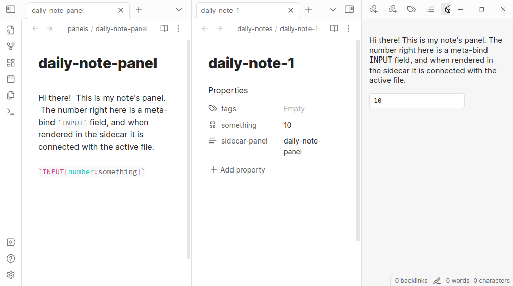

# Sidecar Contextual Panel for Obsidian

This is a plugin that enables you to display a contextual sidebar for given
files, based on the content of a `sidebar-panel` frontmatter property.

These files are rendered as though they are coming from the file in which the
property is set; this enables you to use plugins such as
[obsidian-meta-bind](https://github.com/mProjectsCode/obsidian-meta-bind-plugin)
to create `INPUT` fields that bind to the parent, rather than to the panel
source itself.

One use case, which motivated me to make this, was that I often want to have
different contextual buttons or metadata input lists that display to the side,
so that while I am editing a file I don't have to scroll to the top to change,
for instance, the attendees of a meeting.  Or, so that I can have some buttons
that say things like "Add another TODO" or something like that.



## How to Use

There are two ways to associate a sidecar panel with a file.  The first is to 
set the property `sidecar-panel` in a file (perhaps in a template!) to enable
it.  The second is to add a mapping between a tag (such as `#daily-note`) and a
sidecar panel file (such as `daily-note-editor.md`).  The mapping between tags
and panel files can be done in the `Settings` for the sidecar panel.  When a
file with that set is open and focused, the right leaf will include that sidecar
panel.

For instance, if you have `mysidecar.md` in your Vault with this content:

```
`INPUT[number:somenumber]`

````
INPUT[list:somelist]
````

```

And then another file, `example.md`, with the property `sidecar-panel` set to
`[[mysidecar.md]]`, when you open it the sidecar panel would display that set of
widgets which -- crucially! -- will modify `example.md` rather than
`mysidecar.md`.  Now you have a widget that'll be visible all the time, settable
on a per-file basis, to keep handy buttons and other things visible.

## Multiple Panel Files

It's possible to set multiple cascading files, such that you have multiple
concatenated into one sidecar.  This can be done through multiple tag maps or
through having a tag map and a `sidecar-panel` property.  These will be
concatenated and shown in order of the tag maps and then the `sidecar-panel`
file.

## Roadmap

- [ ] Add support for [metadatamenu](https://github.com/mdelobelle/metadatamenu) `fileClass`es to apply `sidecar-panel` attributes across queries.
- [x] Add per-tag support, so that not all files have to have their properties modified to benefit.
- [ ] Better support changes in properties and sidecar files for open files.

## License

This template is available under the [MIT License](LICENSE). Feel free to modify
and use it to create your own Obsidian plugins.

# Funding

If you find this plugin useful, please consider donating to the [Cystic Fibrosis Foundation](https://give.cff.org/).
